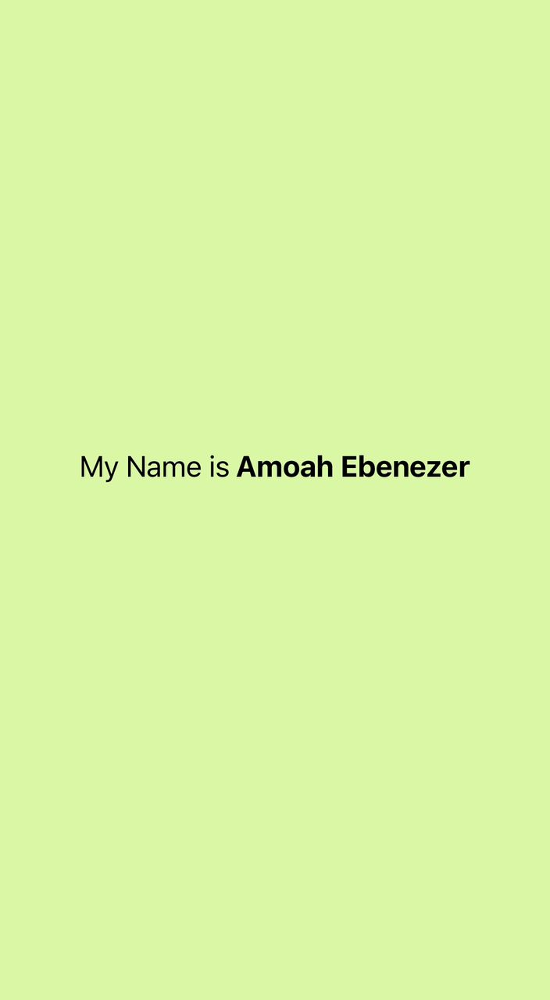

# React Native Assignment 2

## Description

This project is a simple React Native application created using Expo CLI. The task was to:

- Change the background color of the `View` component.
- Edit the `Text` component to display "My name is YourName".
- Increase the font size of the text to 24.
- Make the name "YourName" bold.

## Screenshot

## Student ID

My Student ID: 11183433
